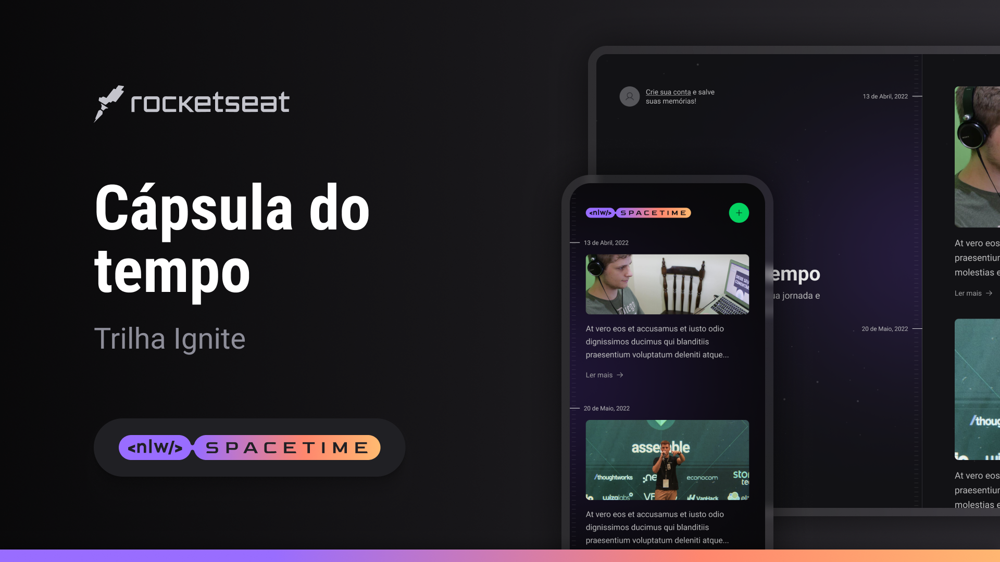

# NLW Spacetime

## About

This is the 12th NLW (Next Level Week) organized for free by Rocketseat, with the theme: Time Capsule  

[ x ] Class 01 - Starting the project from end to end  
[ x ] Class 02 - Advancing the Back-end and Front-End
 
[ x ] Class 03 - Integrating UI with libraries
 
[ x ] Class 04 - Integrating web and mobile projects
 
[ x ] Class 05 - The Next Level

 
Challenges:

[] Edit Memory
 
[] Link to share Memory
 
[] Select Date of Memory (Expo Date Picker to Mobile)
 
[] Responsive Design

## Technologies

- [TypeScript](https://www.typescriptlang.org/)
- [React.Js](https://react.dev/)
- [Next.Js](https://nextjs.org/)
- [React-Native](https://reactnative.dev/) and [Expo](https://expo.dev/)
- [Prisma](https://www.prisma.io/)
- [Fastify](https://www.fastify.io/)
- [TailwindCSS](https://tailwindcss.com/) and [NativeWind](https://www.nativewind.dev/)
- [ESLint](https://eslint.org/) and [Prettier](https://prettier.io/)

